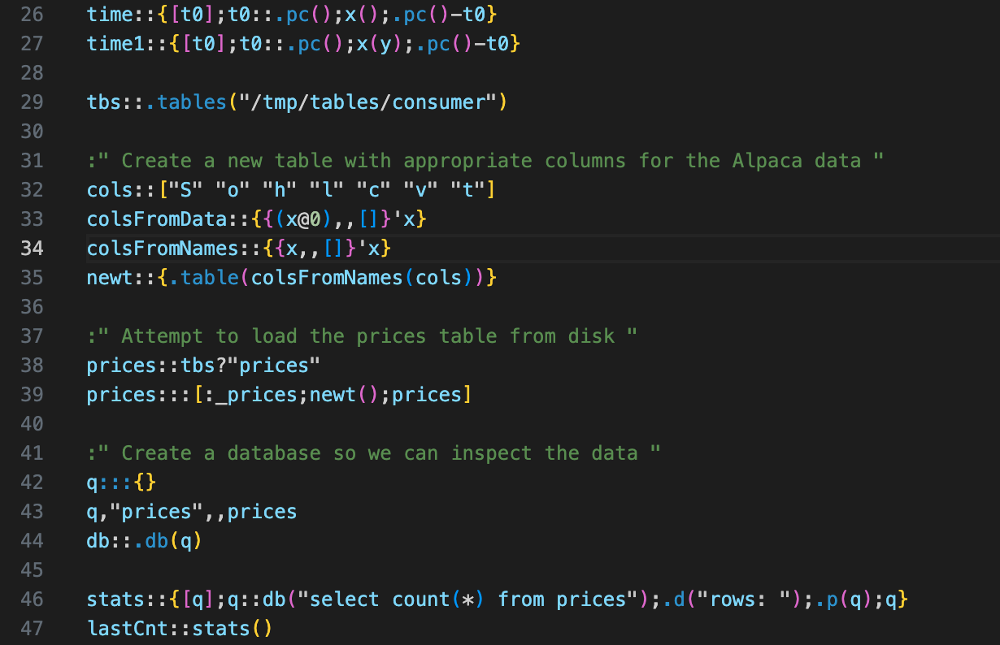

# KlongPy README

This is the README for the "klongpy" extension, providing syntax highlighting for the KlongPy programming language.

## Sample Highlighting

## Features

This extension offers syntax highlighting for KlongPy, making it easier to write and understand KlongPy code. Enjoy clear visual cues for keywords, operators, comments, and more.

> Note: As this is the initial release, further enhancements and support for more complex syntax features are planned.

## Requirements

No specific requirements or dependencies are needed for this extension.

## Extension Settings

This extension does not contribute additional settings in its current version.

## Known Issues

No known issues in the initial release. Please report any bugs or suggestions for improvements.

## Release Notes

### 0.1.0

Initial release of KlongPy code highlighter.

---

## For more information

* [KlongPy](http://klongpy.org)

**Enjoy your KlongPy coding experience in Visual Studio Code!**
